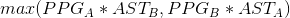
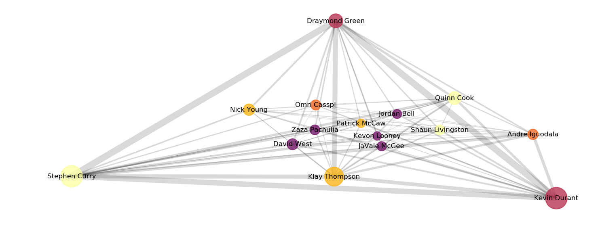
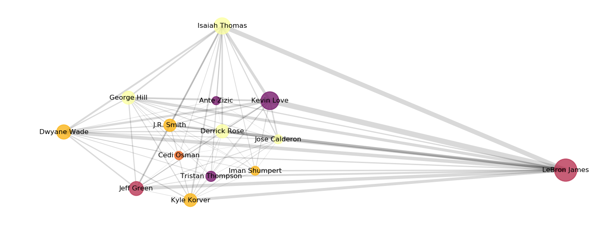

# Basketball_predictions

# Quantifying single player performance and team success by looking at player to player interactions

In recent years, advanced sports analytics has changed the way we evaluate players and teams for all sports. While the popularization of sports analytics started in baseball, most sports have kept some form of statistics for decades. We evaluate how "useful" players are and how they contribute to team success by providing numbers that quantify their performance on the field, court, etc. In many ways, baseball is the perfect sport for an analytical approach: one pitcher faces one batter and each pitch or each at bat represents an independent sample that we can quantify and evaluate. Basketball, however, is more challenging. While there are commonly cited statistics such as how many points a player scores per game (points per game: PPG), or how many passes by a player results in points (assists), these numbers can be difficult to evaluate in isolation. Obviously, it is difficult to score points at the professional level if you are not skilled at basketball, but there might be different expectations depending on the rest of the players on your team. Scoring 25 points per game might be less impressive if you are surrounded by a subpar supporting cast. Fundamentally, basketball is a team game. Therefore to evaluate players and team success, it is useful to evaluate player performance in the framework of the team. To do this we will turn to graph theory to model the pairwise relations between players on a team. Using this approach we can simultaneous evaluate the importance of single player to their team, what team structures are most successful (i.e. lead to the most wins), and potentially provide new metrics for player evaluation.

# Building the graph for each team

All of the single player data was scraped from [here](https://www.basketball-reference.com/) using this code [LINK]. From this website we can collect all of the statistics for each player from multiple years (for the purposes of this work I have only included from 2009-present day). These statistics include per game averages, averages per 100 possesions, and some of the commonly used advanced statistics used in basketball (discussed below). Below you can see a subselection of the stats included for the current NBA champions the Golden State Warriors. We can see all of the players on this team, what position they play (Pos), their points per game and assists, the number minutes played (MP), the number of field goals (baskets) made (FG) and attempted per game (FGA), as well as their shooting percentages for two- and three-point shots (2P% and 3P%)

| Player           | Pos | Tm  | PPG  | AST | MP   | FG  | FGA  | 2P%   | 3P%   |
|------------------|-----|-----|------|-----|------|-----|------|-------|-------|
| Klay Thompson    | SG  | GSW | 20.0 | 2.5 | 34.3 | 7.9 | 16.1 | 0.526 | 0.44  |
| Kevin Durant     | PF  | GSW | 26.4 | 5.4 | 34.2 | 9.3 | 18.0 | 0.565 | 0.419 |
| Draymond Green   | PF  | GSW | 11.0 | 7.3 | 32.7 | 4.0 | 8.8  | 0.562 | 0.301 |
| Stephen Curry    | PG  | GSW | 26.4 | 6.1 | 32.0 | 8.4 | 16.9 | 0.595 | 0.423 |
| Andre Iguodala   | SF  | GSW | 6.0  | 3.3 | 25.3 | 2.3 | 5.0  | 0.567 | 0.282 |
| Quinn Cook       | PG  | GSW | 9.5  | 2.7 | 22.4 | 3.7 | 7.6  | 0.514 | 0.442 |
| Nick Young       | SG  | GSW | 7.3  | 0.5 | 17.4 | 2.5 | 6.1  | 0.481 | 0.377 |
| Patrick McCaw    | SG  | GSW | 4.0  | 1.4 | 16.9 | 1.6 | 3.9  | 0.503 | 0.238 |
| Shaun Livingston | PG  | GSW | 5.5  | 2.0 | 15.9 | 2.4 | 4.8  | 0.509 | 0.0   |
| Jordan Bell      | C   | GSW | 4.6  | 1.8 | 14.2 | 2.0 | 3.2  | 0.641 | 0.0   |
| Zaza Pachulia    | C   | GSW | 5.4  | 1.6 | 14.1 | 2.2 | 3.8  | 0.567 | 0.0   |
| Omri Casspi      | SF  | GSW | 5.7  | 1.0 | 14.0 | 2.3 | 3.9  | 0.595 | 0.455 |
| Kevon Looney     | C   | GSW | 4.0  | 0.6 | 13.8 | 1.7 | 2.9  | 0.59  | 0.2   |
| David West       | C   | GSW | 6.8  | 1.9 | 13.7 | 3.0 | 5.2  | 0.576 | 0.375 |
| JaVale McGee     | C   | GSW | 4.8  | 0.5 | 9.5  | 2.1 | 3.4  | 0.638 | 0.0   |
| Damian Jones     | C   | GSW | 1.7  | 0.1 | 5.9  | 0.7 | 1.5  | 0.5   | 0.0   |
| Chris Boucher    | PF  | GSW | 0.0  | 0.0 | 1.0  | 0.0 | 1.0  | 0.0   | 0.0   |

For each team we can build a graph. Each player will represent a node in the graph, and we will define the edges (the connection between two nodes) as the Scoring Potential of those two player. The Scoring Potential is calculated for player A and player B as:

The result of this is that we can create a directed graph that shows how important on average the connection between two players is for that team. Ideally, we would have access to how many points actually resulted from player A passing to player B, but this data is not freely available and is property of the NBA. Using this approach we can visualize this same Golden State Warriors team as follows:

In this visualization each circle represents a single player, the color of the circle represents their position with lighter colors being smaller ball handlers and dark colors being larger players, and the size of the circle represents how many points that player scores per game. The thickness of the line between two players reflects the Scoring Potential of that pair of players.

If we look at the same plot for the team the Golden State Warriors played in the NBA Finals this year (2018), we can see a very stark contrast in terms of the way the teams were constructed:

While the Golden State Warriors have multiple heavily interconnected nodes with thick lines representing a high Scoring Potential, the Cleveland Cavaliers have essentially one node (LeBron James) that dominates the team graph. He has multiple thick lines emanating from his node, but in one image the graph shows that the Cleveland Cavaliers were strongly dependent on one player for a majority of their Scoring Potential whereas the Golden State Warriors were extremely balanced and could score using many different combinations of players.

