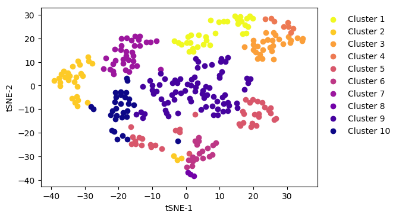
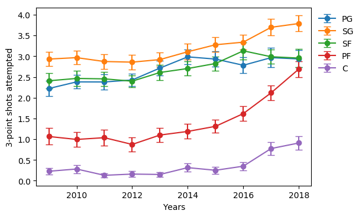
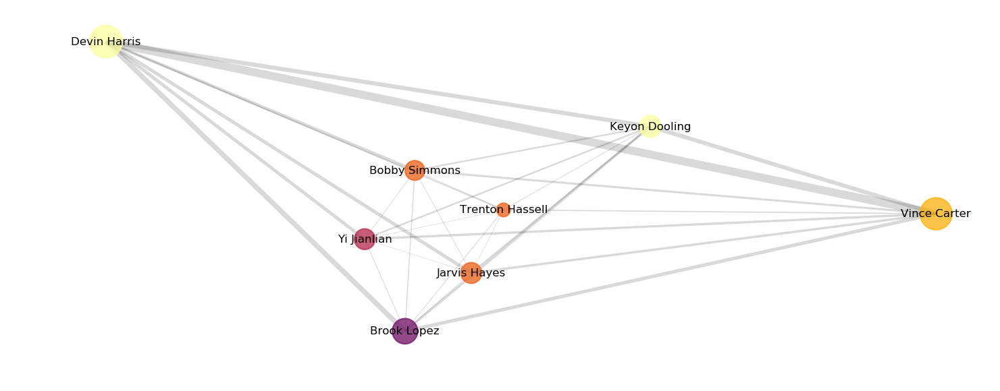

# Basketball_predictions

# Quantifying single player performance and team success by looking at player to player interactions

In recent years, advanced sports analytics has changed the way we evaluate individual players and teams for many sports. While the popularization of sports analytics started in baseball, most sports have kept some form of statistics for decades. We evaluate how "useful" or "valuable" players are by providing numbers that quantify their performance on the field, court, etc. The expectation is that having players with good individual statistics will lead to team success, but it is unclear if this approach works or is ideal for all sports. In many ways, baseball is the perfect sport for this type of analytical approach: one pitcher faces one batter and each pitch or each at bat represents an independent sample that we can quantify and evaluate. Basketball, however, is more challenging. While there are commonly cited statistics such as how many points a player scores per game (points per game: PPG), or how many passes by a player results in points (assists), these numbers can be difficult to evaluate in isolation. In basketball there are only five players on the court for each team. In a standard basketball possession, all five players might touch the ball or influence the current play, suggesting it might be important to quantitatively evaluate how players interact with each other. Fundamentally, basketball is a team game. Therefore to evaluate players and team success, it is useful to evaluate player performance in the framework of the team. To do this we will turn to graph theory to model the pairwise relations between players on a team. Using this approach we can simultaneous evaluate the importance of single player to their team, what team structures or architectures are most successful (i.e. lead to the most wins), and potentially provide new metrics for player evaluation.

## Building the graph for each team

All of the single player data was scraped from [here](https://www.basketball-reference.com/) using this [code](get_yearly_data.ipynb). From this website we can collect all of the statistics for each player from multiple years (for the purposes of this work I have only included from 2009-present day). These statistics include per game averages, averages per 100 possesions, and some of the commonly used advanced statistics used in basketball (discussed below). Below you can see a subselection of the stats included for the current NBA champions, the Golden State Warriors. We can see all of the players on this team, what position they play (Pos), their points per game and assists, the number minutes played (MP), the number of field goals (baskets) made (FG) and attempted per game (FGA), as well as their shooting percentages for two- and three-point shots (2P% and 3P%)

| Player           | Pos | Tm  | PPG  | AST | MP   | FG  | FGA  | 2P%   | 3P%   |
|------------------|-----|-----|------|-----|------|-----|------|-------|-------|
| Klay Thompson    | SG  | GSW | 20.0 | 2.5 | 34.3 | 7.9 | 16.1 | 0.526 | 0.44  |
| Kevin Durant     | PF  | GSW | 26.4 | 5.4 | 34.2 | 9.3 | 18.0 | 0.565 | 0.419 |
| Draymond Green   | PF  | GSW | 11.0 | 7.3 | 32.7 | 4.0 | 8.8  | 0.562 | 0.301 |
| Stephen Curry    | PG  | GSW | 26.4 | 6.1 | 32.0 | 8.4 | 16.9 | 0.595 | 0.423 |
| Andre Iguodala   | SF  | GSW | 6.0  | 3.3 | 25.3 | 2.3 | 5.0  | 0.567 | 0.282 |
| Quinn Cook       | PG  | GSW | 9.5  | 2.7 | 22.4 | 3.7 | 7.6  | 0.514 | 0.442 |
| Nick Young       | SG  | GSW | 7.3  | 0.5 | 17.4 | 2.5 | 6.1  | 0.481 | 0.377 |
| Patrick McCaw    | SG  | GSW | 4.0  | 1.4 | 16.9 | 1.6 | 3.9  | 0.503 | 0.238 |
| Shaun Livingston | PG  | GSW | 5.5  | 2.0 | 15.9 | 2.4 | 4.8  | 0.509 | 0.0   |
| Jordan Bell      | C   | GSW | 4.6  | 1.8 | 14.2 | 2.0 | 3.2  | 0.641 | 0.0   |
| Zaza Pachulia    | C   | GSW | 5.4  | 1.6 | 14.1 | 2.2 | 3.8  | 0.567 | 0.0   |
| Omri Casspi      | SF  | GSW | 5.7  | 1.0 | 14.0 | 2.3 | 3.9  | 0.595 | 0.455 |
| Kevon Looney     | C   | GSW | 4.0  | 0.6 | 13.8 | 1.7 | 2.9  | 0.59  | 0.2   |
| David West       | C   | GSW | 6.8  | 1.9 | 13.7 | 3.0 | 5.2  | 0.576 | 0.375 |
| JaVale McGee     | C   | GSW | 4.8  | 0.5 | 9.5  | 2.1 | 3.4  | 0.638 | 0.0   |
| Damian Jones     | C   | GSW | 1.7  | 0.1 | 5.9  | 0.7 | 1.5  | 0.5   | 0.0   |
| Chris Boucher    | PF  | GSW | 0.0  | 0.0 | 1.0  | 0.0 | 1.0  | 0.0   | 0.0   |

For each team we can build a graph. Each player will represent a node in the graph, and we will define the edges (the connection between two nodes) as the Scoring Potential of those two player. The Scoring Potential is calculated for player A and player B as:

The result of this is that we can create a directed graph that shows how important on average the connection between two players is for that team. Ideally, we would have access to how many points actually resulted from player A passing to player B, but this data is not freely available and is (to the best of my knowledge) property of the NBA. Using this approach we can visualize this same Golden State Warriors team as follows:

In this visualization each circle represents a single player, the color of the circle represents their position with lighter colors being smaller ball handlers (PG, SG) and dark colors being larger players (PF, C), and the size of the circle represents how many points that player scores per game. The thickness of the line between two players reflects the Scoring Potential of that pair of players. Importantly, we can see that a player that does not score that many points, like Draymond Green, can still have high Scoring Potentials (thick lines) associated with him due to the number of assists he has per game (see table above).

If we look at the same plot for the team the Golden State Warriors played in the NBA Finals this year (2018), we can see a very stark contrast in terms of the way the teams were constructed:

While the Golden State Warriors have multiple heavily interconnected nodes with thick lines representing a high Scoring Potential, the Cleveland Cavaliers have essentially one node (LeBron James) that dominates the team graph. All high Scoring Potentials (thick lines) are associated with LeBron James, and there are no thick lines between two non-LeBron James players.
By using this graph-theory approach we can easily show that the Cleveland Cavaliers were strongly dependent on one player whereas the Golden State Warriors were extremely balanced and could score using many different combinations of players.

## Results

* Over the past 10 years there has consistently been 10 different types of team architectures
	* This implies that even though teams are shooting more 3-point shots and playing more "small-ball" (fewer players over 6'10" and more like-size, smaller players on the floor at one time, i.e. Golden State's famous Death-lineup / the Hampton's Five), teams are still organized the same way

* Certain graph/team architectures are more likely to produce wins than losses
	* Winning teams are centered around 1-3 "stars" or players that dominate their teams graph
	* Teams that lose more games than they win are more balanced and less dependent on single players
	* On average, the top 3 players are better on winning teams than on losing teams (as measured by a Player Efficiency Rating or PER)
	* On average, the bottom 5 players (of an 8 man rotation) are worse on winning teams than on losing teams 

* We can use graph theory metrics to predict advanced stats for individual players like Player Efficiency Rating, suggesting player-player and player-team interactions can be used as an evaluation approach
	* The eigenvector centrality (will be discussed below) was most strongly predictive of individual player statistics such as PER, though many other graph theory metrics did contribute

## Analytical approach

I first built a graph for every team from 2009-2018 using data from [here](https://www.basketball-reference.com/) and the methods described above. Because teams will change the players at the end of their roster (i.e. people who do not play very often), I subselected the top 8 players in terms of minutes played for each team. Within my dataset for individual players I scraped individual per game statistics (most commonly used), per 100 possession statistics, and advanced statistics (amalgamations of single player per game and per 100 possession statistics). Importantly, for those players that played for multiple teams within the same season, I only included the team on which they played the most minutes so that I would not double count any player.

I also scraped data for the collective team (total wins vs. losses, points for during each game, points against during each game, etc.) from [here](https://www.foxsports.com/nba/). I combined the graph theory metrics described below and incorporated them into my dataFrame containing the team metrics.

Graph specifics and metrics collected from each graph

* Each graph is a directed graph, meaning that there is a direction ascribed to each edge (lines) between two nodes (players)
	* This will later be useful as it allows us to determine the path within a graph and who acts as a source (i.e a player who passes the ball) and a person who acts as a scorer (the person who receives the pass and scores)
* Each graph is visualized using the Kamada-kawai-layout which is a force based layout strategy that minimizes edge crossings and tries to enforce small uniform edge lengths
	* In this layout, the more important players tend to be on the outside of the graph
* Metrics collected from each graph for each team from every year
	* weighted clustering - the geometric average of the subgraph edge weights
		* clustering refers to tightly connected neighborhoods of nodes, i.e. the number of triangles a node participates in
		* weighted clustering additionally accounts for the Scoring Potential of that edge (connection between 2 nodes)
	* eigenvector centrality - a measure of the influence of a node in a network (in our case a player on his team)
		* a high eigenvector score means a node is connected to other high scoring nodes (i.e. a node is important if it is linked to other important nodes)
	* pagerank - a ranking algorithm to measure the importance of a node by counting the number and quality of edges to that node
		* a high pagerank in our graph means you score but don't generate points and a low pagerank means you pass but don't score
	* dijkstra length - a way to define the shortest path between nodes factoring in the weight of each edge summed across all players in the graph
	* shortest path length - alternate form for measuring path length
	* closeness vitality - how much does the sum of the distances between all other nodes (as measured by edge weights) change when you drop out a node
	* current flow closeness centrality - information centrality - an alternate approach to measuring centrality
		* views the graph as a resistor network with edges as resistors and nodes as junctions

These metrics exist for every single player for all teams between 2009-2018. I then compiled these metrics for each team and performed agglomerative hierarchical clustering and dimensionality reduction on all these metrics using t-sne. By eye, it appeared like I had ~10 clusters, but especially with agglomerative hierarchical clustering it is difficult to properly validate the number of clusters to use. To determine how many clusters I would look at I generated two versions of elbow plots. Using agglomerative hierarchical clustering you could subdivide n teams into n clusters with a single team in each cluster. I took a quick first pass by looking at the mean number of teams per cluster as I increased the number of clusters, and you start to see a deflection point at ~10. This method, however, is not mathematically rigorous, and so to confirm the decision to use 10 clusters I additionally used k-means clustering and looked at the percentage of the variance explained as I increase the number of clusters:

Number of teams per cluster						          |  Percent variance explained
:--------------------------------------------------------:|:-------------------------------------------------------------------:
  |  

Once I confirmed my decision to use 10 clusters, I can now color code my tsne plot to visualize each cluster:

Importantly, if we look across all years included in this analysis (2009-2018), we do not see a bias to any particular cluster in more recent years. This means that from 2009-2018 the way teams are organized has been relatively stable and similar. We can visualize this by plotting each year in a different color and superimpose these colors on the tsne plot or by visualizing the number of teams in each cluster by year:

tSNE scatter by year       						 |  Number of teams per cluster each year
:-----------------------------------------------:|:---------------------------------------------:
  |  

Using both approaches we can see that in the last 10 years teams have been organized pretty similarly. This is despite the recent movement in basketball to what is affectionately called "small-ball," or putting smaller, like-sized players on the same team. This recent trend is most strikingly observed when considering how the position of power-forward or (PF) has changed from a big, physical player who shoots the ball close to the hoop (almost similar to a center, C), to shooting a high volume of 3-point shots:

We can now easily visualize how each graph metric that we used contributed to the dimensionality reduction used:

Eigenvector centrality       		   |  Pagerank    	  						       |  Dijkstra length
:-------------------------------------:|:---------------------------------------------:|:--------------------------------------:
     |   	       |   

We can easily see that different clusters are more strongly weighted to different metrics with brighter colors being larger values for each graph metric.

## Are cluster predictive of team performance?

We can now use the same approach to see if the clusters we have identified are actually predictive of teams winning games. To quantify this we will subtract the number of losses (L) from the number of wins (W). I will now take the same approach and visualize W-L on top of the same tsne plot with brighter colors implying a team won more games than it lost. I can additionally show this by taking the mean W-L in all teams within a cluster and showing a barplot:

Clusters 				       		   |  Wins - Losses tSNE plot    	  			   |  Wins - Losses barplot for individual clusters
:-------------------------------------:|:---------------------------------------------:|:---------------------------------------------:
|   	           |   

While in the tsne plot we see a clustering of bright colors in some clusters but not in others, the predictive power of each cluster is clear using the barplot (number of teams per cluster above or below each bar). Teams in clusters 2 and 8 were more likely to win games than to lose games, and teams in clusters 3 and 4 were more likely to lose games than to win games. This suggests there is something about the graphs for teams in clusters 2 and 8 that make them more likely to win vs. lose.

To confirm this was due to the graph structure of the teams and not something trivial, as a control, we generated the same plots but for the two metrics used to build the graphs: points per game (PPG) and assists per game (APG). For example, we do not want clusters 2 and 8 to win more games simply because they score more points.

Points per game (PPG)     						 |  Assists per game (APG)
:-----------------------------------------------:|:---------------------------------------------:
       |  

These graphs suggest that it is something specific about the structure/architecture of the team or the way the team is organized that predicts the team winning more games than it loses. To gain intuition about the team structure in clusters 2, 3, 4, and 8 let's look at some example graphs for each of these teams. For graphs of every team for all clusters see Figures/TeamGraphs.

Teams in cluster 2 		 				     |  Teams in cluster 2 		   	  			       
:-------------------------------------------:|:---------------------------------------------:
|   
|  
|  

Teams in cluster 8 		 				     |  Teams in cluster 8 		   	  			     |  Teams in cluster 8 
:-------------------------------------------:|:---------------------------------------------:|:---------------------------------------------:
|  |   

Teams in cluster 3 		 				     |  Teams in cluster 4 		   	  	     
:-------------------------------------------:|:---------------------------------------------:
|  
|  
|  

When we look at all of these graphs, we see something really interesting. Cluster 2 is dominated by teams with 1-2 really important nodes that dictate a majority of the edges for each team (nodes on the outside portion of each graph with thick lines connected to multiple other nodes). Strikingly, cluster 8 has only three teams, and the teams are the Los Angeles Lakers from 2009-2011. There was no information during the clustering about the identity of each team, so there is something about the architecture of these teams that caused them to be clustered. These three Lakers teams were very successful. In 2009 and 2010 the Lakers won the championship and in 2011 they reached the conference semifinals.

Clusters 3 and 4 contained teams that on average lost more games than they won. Looking at these graphs we see very distributed, evenly spaced graphs without many "important nodes" as described above. This suggests these teams were less dominated by single players, and were more balanced, i.e. more players contributed to the Scoring Potential of each team.

Looking at these graphs, I hypothesized that teams in clusters 2 and 8 were dominated by 1-3 "star players," whereas cluster 3 and 4 were more egalitarian in their roster construction. To test this hypothesis we turned to a commonly used advanced statistic called Player Efficiency Rating or PER. This statistic was created by ESPN's John Hollinger and "sums all of a player's positive accomplishments, subtracts the negative accomplishments and returns a per-minute rating of a player's performance." It is considered that an average NBA player will have a PER of 15,  a borderline All-Star will have a PER of 20+, and a Definite All-Star will have a PER of 22.5+ (see [here](https://en.wikipedia.org/wiki/Player_efficiency_rating). For all teams we ranked their players from highest to lowest PER and looked at this for each cluster:

Strikingly, we see that for clusters 2 and 8, their top 2 players are better than the 2 best players for clusters 3 and 4 (still need to do statistical tests). Players 5-8 (the rest of their playing rotation) are worse for clusters 2 and 8 than for clusters 3 and 4. This suggests that the teams that win the most games have 1-2 really good players and the rest of their players are average or below average, and teams that lose more games than they win are more evenly distributed. Looking at a graph like this suggests that teams should invest most of their money into a few very good players, and fill out the rest of the roster with average to below average players.

## Predicting Player Efficiency Rating (PER) from graph theory metrics

We then asked which of our graph metrics most strongly predicted being an "All-Star" or were most predictive of the PER metric described above. To do this we implemented a Random Forests Classifier. This approach will build a "forest" of decision trees, each of which votes, and the forest chooses the classification with the most votes. In order to build this classifier we subdivided the Player Efficiency Rating statistic from the last 10 years into 3 equally sized bins as shown below:

Once again, an average player has a PER of 15.0. When we trained the classifier, theoretically, you can just use the out-of-bag score (those options held out during the construction of a decision tree), however, I was still worried about potentially overfitting so I intentially built the Random Forests model using 80% of the data and tested on the other 20%. I also had to decide how many trees to have in my Forest, and so I initially tried a range of 20-500 trees:

We can clearly see the classifier performs above chance (still should do stats to validate; dotted line represents chance), and that as hoped for / expected the prediction accuracy out-of-bag and the test set accuracy is very similar. If I then choose to use 100 trees for my final model, I can build a confusion matrix to show the model performance for all 3 bins and where the model made errors:

Perhaps unsurprisingly, the model classified above-average and below-average players relatively well, about 70% prediction accuracy and up, but struggled more with players in the mid PER category. Future work should dive deeper into these errors because it could be that the graph theory metrics that we are using might actually provide insight into the interaction between single player and multiplayer metrics.

Finally, using the approach we can ask what graph theory metrics were most predictive of the Player Efficiency Rating (PER) metric:

We can now see that Eigenvector Centrality, a measure of the influence of a node in the network, was most predictive of PER, but many of the graph theory metrics contributed to this classification.

## Future directions

1. I initially pitched this approach as a way to analyze players within the framework of a team. Who are the players that the graph theory metrics think are important, but are not as highly rated by single player statistics? Other than eigenvector centrality, what are the most important other metrics to think about?
	* Potential approach: if a single player statistical metric and a graph theory metric are correlated look at the players with the largest residuals, i.e. those players that are furthest from the best fit line

2. With the move to more "small-ball" lineups, how has the Power-Forward position's role changed within the constraints of the graph. Is this at all predictive of a team's success?
	* Potential approach: identify those teams with the largest jump in 3-point shot attempts for Power-Forwards from year 1 to year 2, look at the graph metrics for such a player and ask if any of these are predictive of an increase in wins? Obviously it will be tough to control for other changes... maybe partial correlations or a generalized linear model?

3. Evaluate player improvement. Let's identify those players with the largest jump in PER from year 1 to year 2. What were the ways in which this player got better? Was it usually in a specific manner as it relates to the team?

4. Look at the evolution of pairs of players and how this benefits team performance. As players play more with their teammates and improve, the Scoring Potential between teammates might increase. It would be interesting to know if the edge weight (Scoring Potential) between two specific players is predictive of the team's record and of how much a team improves their record.

